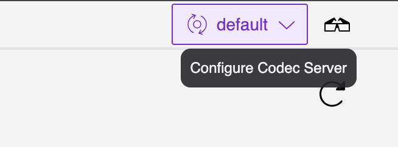
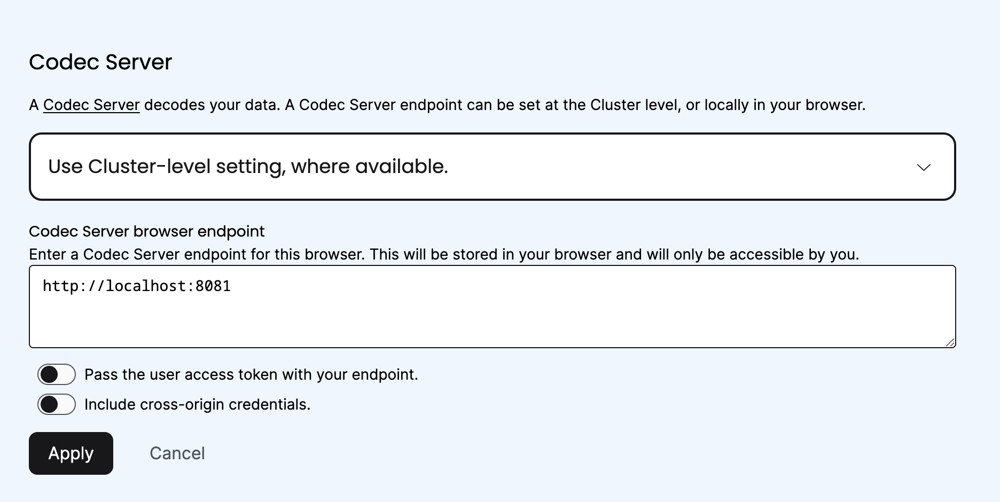
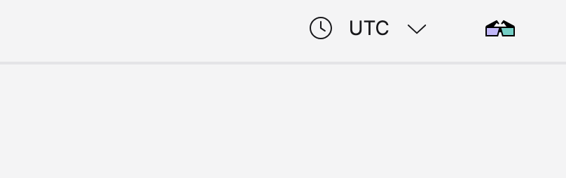

# Exercise 2: Deploy a Codec Server and Integrate with the Web UI

During this exercise, you will:

* Review a Codec Server implementation
* Configure a Codec Server to share your custom converter logic
* Enable CORS and review other deployment parameters
* Integrate your Codec Server with the Temporal Web UI
* Securely return decoded results in the CLI and the Web UI

Make your changes to the code in the `practice` subdirectory (look for 
`TODO` comments that will guide you to where you should make changes to 
the code). If you need a hint or want to verify your changes, look at 
the complete version in the `solution` subdirectory.


## Part A: Configure a Codec Server to Use Your Data Converter

1. First, you'll review a barebones Codec Server implementation in Python, and make
   the necessary changes to integrate the custom data converter from Exercise 1.
   Examine the `codec-server.py`. This file contains a complete HTTP server
   implementation using Python's
   [Flask](https://flask.palletsprojects.com/en/3.0.x/) library. It listens on
   endpoints at `/{namespace}/encode` and `/{namespace}/decode` as expected by
   the Temporal CLI, Web UI, and SDKs, and contains stubs for OIDC and CORS
   enablement. These are the baseline requirements for a Temporal Codec Server,
   which can be implemented using standard HTTP functionality in any language of
   your choosing.
2. Temporal Codec Servers need, at minimum, one additional configuration detail
   before they can be deployed from sample code. Specifically, Codec Servers
   need to import the Converter logic from your own application, and then map
   the Converter logic on a per-Namespace basis. Add an `import` statement at
   the top of `codec-server.py` to import the rest of your application as a
   Python library named `temporalconverters`.
3. Next, create an array named `codecs` in the `main()` function of
   `codec-server.py`. Keys should be Namespace strings. Values should be of
   the type `converter.PayloadCodec`. By default, you only need to assign the
   `default` namespace to `{temporalconverters.NewPayloadCodec()}` from this
   example.
4. After making these additions, you should have a functioning Codec Server,
   integrated with your application logic. Again, everything else in here is
   configured as generically as possible — note that this example Codec Server
   listens on port 8081, which is usually used in testing configurations — but
   this fulfills all the requirements of a Temporal Codec Server, and you could
   incorporate any other authentication requirements on top of HTTP as needed.
   Run your Codec Server with `python codec-server.py` from the root of your
   project directory. This will block the terminal it runs in, and await
   connections.
5. Now you can retrieve the decoded output of your Workflow Execution from the
   previous Exercise. From another terminal window, run `temporal workflow show \
   -w converters_workflowID --codec-endpoint 'http://localhost:8081/{namespace}'`.
   It should retain the same Event History as before, with the decoded result
   appended to the output:

   ```
   ...
   Result:
     Status: COMPLETED
     Output: ["Received Plain text input"]
   ```

   You now have a working Codec Server implementation. In the following steps,
   you'll learn how to integrate it more closely with a Temporal Cluster for
   production environments.


## Part B: Enable CORS and Configure Temporal Web UI Integration

1. The next step is to enable Codec Server integration with the Temporal Web UI.
   This isn't necessary if you don't plan to use the Web UI to view your
   Workflow output, but it provides a stock example of how to integrate Codec
   Server requests into a web app, and is supported by Temporal Cloud. Without
   Codec Server integration, the Temporal Web UI cannot decode output, and
   results are displayed encoded:

   

   To do this, you first need to enable
   [CORS](https://en.wikipedia.org/wiki/Cross-origin_resource_sharing), a common
   HTTP feature for securely making cross-domain requests.
   `codec-server.py` contains a function called `newCORSHTTPHandler()`
   which will add the necessary headers to your HTTP requests to support CORS,
   but it is not enabled by default. This example Codec Server exposes an
   additional command line parameter, `--web`, to conditionally enable CORS.
   Restart the Codec Server with the `--web` flag: `python codec-server.py --web
   localhost:8233`.
2. Now you can proceed to integrate your Codec Server with the Web UI. You
   should already have a local Temporal Cluster running that you can access in a
   browser at `http://localhost:8233` by default. In the top-right corner of the
   Web UI, you should see a 3D glasses icon, where you can access the Codec
   Server settings:

   

   In the Codec Server settings menu, add the path to your Codec Server, which
   should be `http://localhost:8081` by default. You do not need to toggle the
   user access token settings if you aren't using authentication.

   

   Note that you can toggle the "Use Cluster-level setting" option to save this
   Codec Server for all users of this cluster, or only for you, which would be
   especially relevant if you were running a `localhost` Codec Server with a
   remote Temporal Cluster. Click the "Apply" button. The 3D glasses in the
   top nav should now be colorized, indicating a successful connection:

   

1. When you navigate back to your Workflow History and scroll to the "Input
   and Results" section, you should find your payload automatically decoded by
   your Codec Server:

   

   You now have a working Codec Server integration with the Temporal Web UI.


### This is the end of the exercise.

